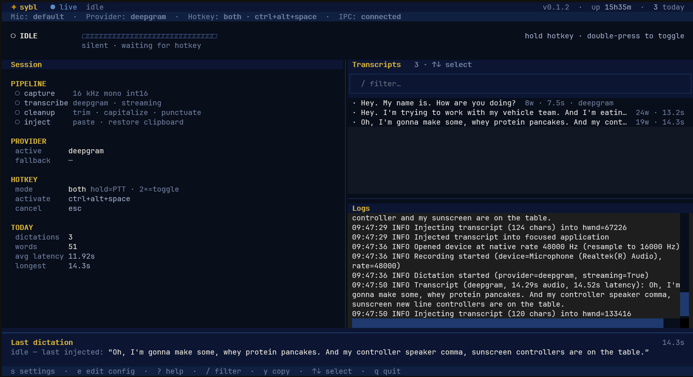

# sybl

> Open-source BYOK voice dictation — speak anywhere, type it in.

[](https://github.com/Rikhil-Nell/sybl/actions/workflows/ci.yml)
[](LICENSE)
[](https://www.python.org/downloads/)
[](https://pypi.org/project/sybl/)



**sybl** is a background voice dictation daemon for Windows. Put your cursor in
any text field, hit a global hotkey, speak, and sybl transcribes with your own
Groq or Deepgram API key and pastes the result where you were typing.

Audio goes straight from your machine to the STT provider you configure. sybl
does not host a backend, store transcripts in the cloud, or run telemetry.

## Features

- **Global hotkey** — works in whatever app had focus when you activated
- **Push-to-talk and toggle** — hold to speak, or double-press for hands-free;
  both on the same binding by default
- **BYOK providers** — Groq (Whisper batch) and Deepgram (streaming + batch);
  add your key once via the OS keyring
- **Text injection** — clipboard paste into the target field; prior clipboard
  restored after
- **Dock listening pill** — wave bars, timer, and transcribing state at the top
  of the screen while you dictate
- **Mission-control TUI** — live status, session details, transcript history,
  logs, and settings over IPC (`sybl tui`)
- **Post-processing** — whitespace trim, filler trim, capitalization; optional
  punctuation
- **Vocabulary hints** — names and jargon sent to the provider at session start
- **Voice commands** — `new line`, `period`, `comma` on the final transcript
- **Scriptable CLI** — `start`, `stop`, `status`, `transcribe`, `doctor`,
  `config`, JSON output where it helps automation

## Quick start

```powershell
uv tool install sybl
sybl setup
sybl start
sybl tui                      # optional dashboard
```

Default hotkey: **Ctrl+Alt+Space**. Hold ~200 ms for push-to-talk, or
double-press for toggle. **Esc** cancels while listening.

**[Full user guide →](docs/guide.md)** — providers, config, CLI reference,
permissions, troubleshooting.

| | |
| --- | --- |
| Listening pill |  |

## Platform status

| | Windows | macOS / Linux |
| --- | --- | --- |
| Hotkeys | Yes | Planned |
| Text injection | Yes | Planned |
| Listening pill | Yes | Planned |
| Daemon + TUI + CLI | Yes | Yes |

Windows is the primary target for the full dictation loop. Other platforms can
run the daemon and CLI today; hotkeys, injection, and the pill land in v0.2.0.

## Contributing

[CONTRIBUTING.md](CONTRIBUTING.md) · [AGENTS.md](AGENTS.md) · [CHANGELOG.md](CHANGELOG.md)

## License

[MIT](LICENSE) © Rikhil Nellimarla
